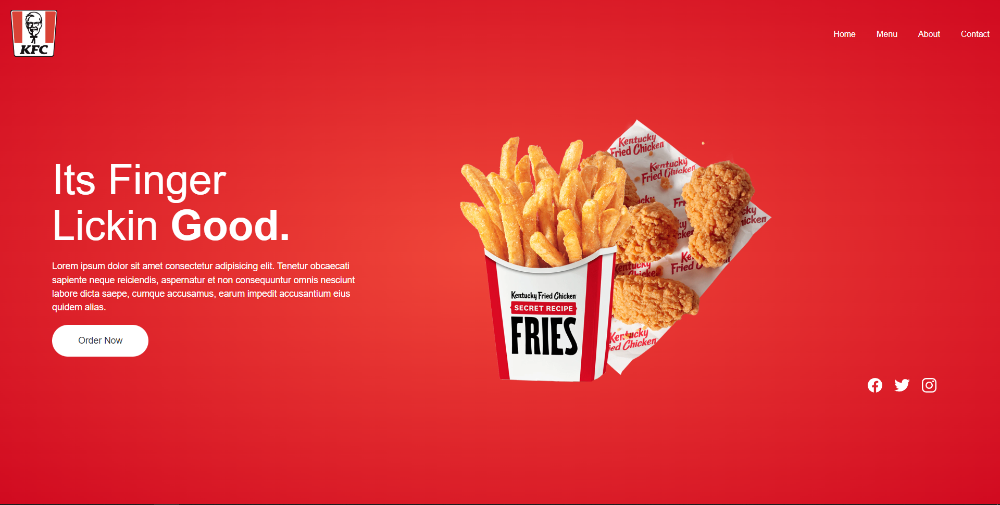
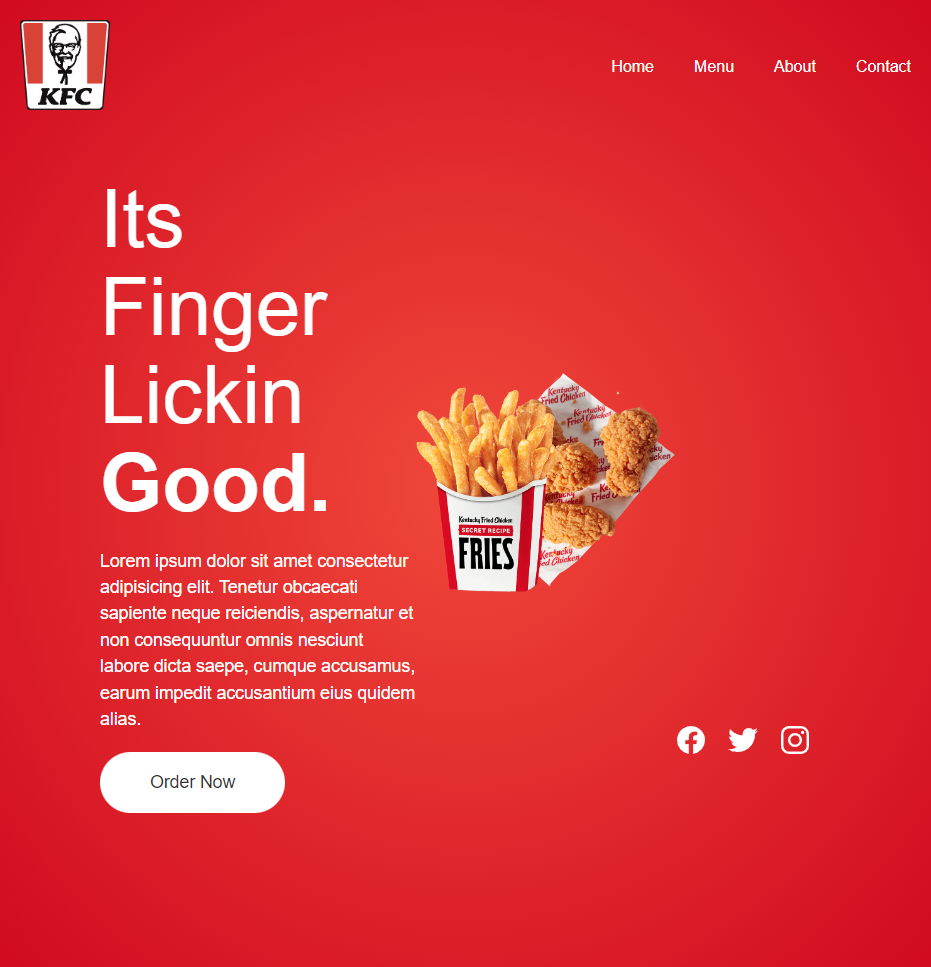

# Landing Page KFC

This project is about a KFC inspired responsive landing page.

# Screens Project

## Computer


## Phone or Tablet
<div align="center">


</div>


# Install

```sh
git clone https://github.com/asalinasf/landing-page-KFC/
cd landing-page-KFC
open in your browse
```

# HTML
```html
<!DOCTYPE html>
<html lang="es">

<head>
    <meta charset="UTF-8">
    <meta http-equiv="X-UA-Compatible" content="IE=edge">
    <meta name="viewport" content="width=device-width, initial-scale=1.0">
    <title>Landing Page</title>
    <link rel="stylesheet" href="./css/styles.css">
    <link rel="shortcut icon" href="./img/logo.png" type="image/x-icon">
</head>

<body>
    <main class="main">
        <header class="">
            <a href="#"> </a>
            <ul class="navegation">
                <li> <a href="#">Home</a></li>
                <li> <a href="#">Menu</a></li>
                <li> <a href="#">About</a></li>
                <li> <a href="#">Contact</a></li>
            </ul>
        </header>
        <div class="content">
            <div class="text">
                <h2>Its Finger<br>Lickin <span>Good.</span></h2>
                <p>Lorem ipsum dolor sit amet consectetur adipisicing elit. Tenetur obcaecati sapiente neque reiciendis,
                    aspernatur et non consequuntur omnis nesciunt labore dicta saepe, cumque accusamus, earum impedit
                    accusantium eius quidem alias.</p>
                <a href="#" class="btn">Order Now</a>
            </div>
            <div class="content-img">
                <div  class="imgMuestra"x>
                    

                </div>

        </div>
        <footer class="footer">
            <ul class="sci">
                <li><a href="#"><ion-icon name="logo-facebook"></ion-icon></a></li>
                <li><a href="#"><ion-icon name="logo-twitter"></ion-icon></a></li>
                <li><a href="#"><ion-icon name="logo-instagram"></ion-icon></a></li>
            </ul>
        </footer>
        <script type="module" src="https://unpkg.com/ionicons@5.5.2/dist/ionicons/ionicons.esm.js"></script>
        <script nomodule src="https://unpkg.com/ionicons@5.5.2/dist/ionicons/ionicons.js"></script>
    </main>
</body>

</html>
```

# CSS
```css
* {
  padding: 0;
  margin: 0;
  box-sizing: border-box;
  font-family: sans-serif;
}

.main {
  position: relative;
  min-height: 100vh;
  background: radial-gradient(#f0483a, #d10a20);
  display: flex;
  justify-content: center;
  flex-direction: column;
  align-items: center;
  padding: 30px 100px;
}
.main header {
  padding: 20px;
  min-width: 100%;
  position: absolute;
  top: 0;
  left: 0;
  display: flex;
  justify-content: space-between;
  align-items: center;
  z-index: 1000;
}
.main header .logo {
  max-width: 90px;
}
.main header .navegation {
  display: flex;
}
.main header .navegation li {
  list-style: none;
  transition: 0.25s;
}
.main header .navegation li:hover {
  transform: translateY(-5px);
}
.main header .navegation li a {
  position: relative;
  color: #fff;
  text-decoration: none;
  margin-left: 40px;
}
.main .content {
  position: relative;
  width: 100%;
  display: flex;
  justify-content: space-between;
  align-items: center;
}
.main .content .text {
  width: 100%;
  max-width: 600px;
}
.main .content .text h2 {
  color: #fff;
  font-size: 5em;
  font-weight: 300;
  line-height: 1.1em;
  margin: 20px 0;
}
.main .content .text h2 span {
  font-weight: 700;
}
.main .content .text p {
  color: #fff;
  font-weight: 400;
  font-size: 1.1em;
  line-height: 1.5em;
  margin: 20px 0;
}
.main .content .text .btn {
  position: relative;
  display: inline-block;
  padding: 20px 50px;
  background-color: white;
  color: #333;
  font-size: 1.1em;
  font-weight: 500;
  border-radius: 40px;
  text-decoration: none;
  transition: 0.25s;
}
.main .content .text .btn:hover {
  letter-spacing: 2px;
}
.main .content .content-img {
  position: relative;
}
.main .content .content-img .imgMuestra {
  display: block;
}
.main .content .content-img .imgMuestra img {
  width: 100%;
  max-width: 600px;
}
.main .footer .sci {
  display: flex;
  width: 100%;
  margin-top: 520px;
}
.main .footer .sci li {
  list-style: none;
}
.main .footer .sci li a {
  color: #fff;
  font-size: 2em;
  margin-right: 20px;
  display: inline-block;
  transition: 0.25s;
}
.main .footer .sci li a:hover {
  transform: translateY(-5px);
}

@media (max-width: 600px) {
  .main {
    padding: 20px;
  }
  .main .content .text h2 {
    margin-top: 40px;
  }
  .sci {
    margin-top: 40px;
    margin-right: -80px;
  }
}
```
# Visit my project with this url

https://landing-page-kfc.netlify.app/
